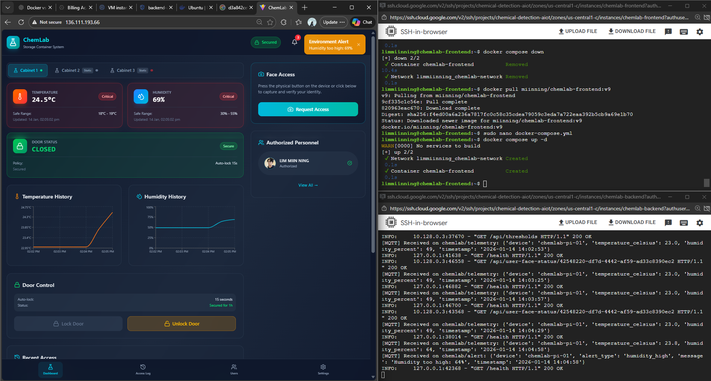

# ChemLab Access Control System 🧪🔐

A comprehensive IoT-based chemical storage access control system featuring **AI face recognition**, **dual-voice feedback**, **environmental monitoring**, **real-time dashboard**, and **intrusion detection**.

---

## ✨ Key Features

| Feature | Description |
|---------|-------------|
| 🔐 **AI Face Recognition** | Multi-image biometric authentication using averaged face encodings for robust accuracy |
| 🎤 **Dual Voice System** | Female voice (gTTS) for friendly messages, Male voice (Festival) for security alerts |
| 🌡️ **Environmental Monitoring** | Real-time temperature & humidity tracking with configurable thresholds |
| 🚨 **Intrusion Detection** | IR sensor-based door monitoring with automatic siren and voice alerts |
| 📱 **Mobile-Responsive Dashboard** | Modern React dashboard with bottom navigation and live data |
| 🔒 **Smart Door Lock** | Servo control with 15-second auto-lock and visual countdown timer |
| ⏱️ **Live Countdown** | Real-time countdown displayed on dashboard showing time until auto-lock |
| 📊 **Access Logging** | Complete access history with timestamps stored in Supabase |
| 🔔 **Notification Center** | Slide-out panel with click-outside dismissal for system events |
| 📈 **Historical Charts** | Temperature and humidity trends visualized with Recharts |

---

## 🆕 Latest Updates

### 🐳 Docker & Cloud Deployment

- **Docker Containerization**: Frontend and Backend fully containerized with optimized multi-stage builds
- **GCP Cloud Run**: One-click deployment to Google Cloud Platform via Docker Hub
- **Nginx Reverse Proxy**: Production-ready frontend serving with API proxying
- **Environment Config**: Flexible `.env` configuration for local/cloud deployment

### 🗄️ Multi-Cabinet Demo

- **Cabinet Selector Tabs**: Switch between Cabinet 1 (live IoT), Cabinet 2 (offline demo), Cabinet 3 (intrusion alert)
- **Static Demo Data**: Fake temperature, humidity, access logs, and personnel for demo cabinets
- **Intrusion Simulation**: Cabinet 3 shows red alert status, unlocked door, unknown person access, and temp spike
- **Settings Integration**: Environment thresholds configurable per-cabinet with read-only demo mode

### Voice System

- **Dual Voice Profiles**: Context-aware voice selection
  - **Female Voice** (gTTS + mpg123): Friendly, welcoming tone
  - **Male Voice** (Festival/espeak-ng): Authoritative, warning tone
- **Optimized Playback**: Single announcement per action (no overlapping voices)

### Dashboard Improvements

- **Bottom Navigation Bar**: Mobile-friendly tab navigation fixed at screen bottom
- **Real-time Countdown**: 15-second auto-lock countdown with pulsing animation
- **SweetAlert Integration**: Loading indicators during face registration
- **Flask Icon Branding**: ChemLab-themed flask icon throughout the UI
- **Responsive Header**: Compact mobile view with adaptive spacing

### Security Enhancements

- **Unlock Source Tracking**: Differentiates between `authorized` (face), `remote` (dashboard), and `forced` access
- **Immediate Lock on Close**: Door locks instantly when IR sensor detects door closure
- **Smart Intrusion Detection**: Alerts only when door opened without authorization

---

## 🔄 Complete User Workflow

### 1. User Registration (One-time Setup)

1. Admin logs into the Web Dashboard
2. Navigate to **Users** tab → Click **"Add User"**
3. Upload 3-5 clear photos of the authorized person
4. System computes averaged biometric template
5. SweetAlert shows "Processing..." → "Face Registered!" confirmation

### 2. Access Request Flow

1. User approaches the storage container
2. Presses the **Physical Button** on the Raspberry Pi
3. **Camera** captures a high-resolution photo
4. Image is uploaded to Supabase Storage
5. Backend receives the image URL and performs face recognition

### 3. Authentication Response

**If Authorized:**
```
Female Voice: "Access Granted. Welcome, [Name]"
→ Servo rotates to 90° (unlocked)
→ Dashboard shows: "OPEN" + "Auto-lock in 15s" countdown
→ After door closes OR 15 seconds → Auto-lock
```

**If Unauthorized:**
```
Male Voice: "Access Denied. You are not authorized to enter this area."
→ LED flashes + Buzzer sounds (siren pattern)
→ Male Voice: "Alert! Intrusion Detected"
→ Dashboard shows Security Alert notification
```

**If No Face Detected:**
```
Male Voice: "No face detected. Please look at the camera and try again."
→ No siren (just a positioning issue)
```

### 4. Auto-Lock Behavior

| Scenario | Action |
|----------|--------|
| Door never opened | Female: "Door closed." → Silent lock |
| Door opened then closed | Immediate lock on IR detection |
| Door left open > 15s | Female: "Please close the door." (every 15s) |

---

## 🏗️ System Architecture

```
┌─────────────────────────────────────────────────────────────┐
│                    Web Dashboard (React)                     │
│                  http://localhost:5173                       │
│                                                              │
│  ┌─────────────┐  ┌─────────────┐  ┌─────────────────────┐  │
│  │  Dashboard  │  │ Access Log  │  │ Users │ Settings    │  │
│  │             │  │             │  │                     │  │
│  │ • Door Card │  │ • History   │  │ • Add User          │  │
│  │ • Countdown │  │ • Timeline  │  │ • Face Registration │  │
│  │ • Temp/Hum  │  │             │  │ • Thresholds        │  │
│  │ • Charts    │  │             │  │                     │  │
│  └─────────────┘  └─────────────┘  └─────────────────────┘  │
│                                                              │
│  [Bottom Navigation: Dashboard | Access Log | Users | Settings]
└──────────────────────────┬──────────────────────────────────┘
                           │ WebSocket + REST API
┌──────────────────────────▼──────────────────────────────────┐
│                  Backend Server (FastAPI)                    │
│                  http://localhost:8000                       │
│                                                              │
│  • /api/register-face    - Multi-image face registration    │
│  • /api/trigger          - Remote capture/lock/unlock       │
│  • /ws                   - Real-time WebSocket updates      │
│  • MQTT Handler          - Bi-directional IoT communication │
│  • Anomaly Detection     - Temperature/humidity monitoring  │
└──────────────────────────┬──────────────────────────────────┘
                           │ MQTT Protocol (chemlab/*)
┌──────────────────────────▼──────────────────────────────────┐
│               Raspberry Pi 2 Model B                         │
│                                                              │
│  ┌─────────────────┐  ┌─────────────────────────────────┐   │
│  │ Input Sensors   │  │ Output Actuators                │   │
│  │                 │  │                                 │   │
│  │ • Pi Camera     │  │ • Servo Motor (Door Lock)       │   │
│  │ • DHT11 Sensor  │  │ • Red LED (Visual Alert)        │   │
│  │ • Push Button   │  │ • Buzzer (Audio Alert)          │   │
│  │ • IR Sensor     │  │ • Speaker (Voice Feedback)      │   │
│  └─────────────────┘  └─────────────────────────────────┘   │
│                                                              │
│  ┌─────────────────────────────────────────────────────┐    │
│  │ Voice Modules                                        │    │
│  │ • voice/femaleTalk.py - gTTS + mpg123               │    │
│  │ • voice/maleTalk.py   - Festival/espeak-ng          │    │
│  └─────────────────────────────────────────────────────┘    │
└─────────────────────────────────────────────────────────────┘
```

---

## 🚀 Installation Guide

### Prerequisites

- Python 3.11+ (Miniconda recommended for Windows)
- Node.js 18+
- Raspberry Pi 2/3/4 with Pi Camera
- Supabase account (PostgreSQL + Storage)
- MQTT Broker (e.g., Mosquitto, HiveMQ Cloud)
- Docker (optional, for containerized deployment)

### 🐳 Docker Deployment (Recommended for Cloud)

#### Option 1: Local Docker Development

```bash
# Build and run both frontend and backend
docker-compose up --build

# Access:
# - Frontend: http://localhost:5173
# - Backend: http://localhost:8000
```

#### Option 2: Deploy to GCP Cloud Run via Docker Hub

**Step 1: Build and push images to Docker Hub**

```bash
# Backend
cd backend
docker build -t yourusername/chemlab-backend:latest .
docker push yourusername/chemlab-backend:latest

# Frontend
cd frontend
docker build -t yourusername/chemlab-frontend:latest .
docker push yourusername/chemlab-frontend:latest
```

**Step 2: Deploy to GCP Cloud Run**

1. Go to [GCP Console](https://console.cloud.google.com/run) → Cloud Run
2. Click **Create Service** → Select **Deploy from existing container image**
3. Enter: `docker.io/yourusername/chemlab-backend:latest`
4. Set port to **8000** for backend, **80** for frontend
5. Add environment variables from `.env` files
6. Click **Create** and copy the service URL

**Environment Variables Required:**

```bash
# Backend (.env)
SUPABASE_URL=https://xxx.supabase.co
SUPABASE_KEY=your-service-role-key
MQTT_BROKER=your-mqtt-broker.com
MQTT_PORT=8883
MQTT_USER=your-mqtt-user
MQTT_PASS=your-mqtt-password

# Frontend (.env)
VITE_API_URL=https://your-backend-cloudrun-url
VITE_WS_URL=wss://your-backend-cloudrun-url/ws
```

### 🐍 Why Miniconda? (Face Recognition Dependencies)

The `face_recognition` library is the core of our biometric authentication system. It uses **dlib**, a powerful C++ machine learning library, to compute 128-dimensional face encodings. However, installing dlib on Windows presents significant challenges:

#### The Problem

```
pip install dlib  # ❌ Often fails on Windows!
```

**Common errors:**
- `CMake error: No CMAKE_C_COMPILER could be found`
- `error: Microsoft Visual C++ 14.0 or greater is required`
- Build timeouts and memory issues during compilation

**Root Cause:** dlib requires C++ compilation tools (CMake, Visual Studio Build Tools) that are complex to configure correctly on Windows.

#### The Solution: Miniconda

Miniconda provides **pre-compiled binary packages** through conda-forge, bypassing the need for local C++ compilation entirely:

```bash
# ✅ Works reliably on Windows, macOS, and Linux
conda install -c conda-forge dlib -y
```

**Benefits of Miniconda:**

| Benefit | Description |
|---------|-------------|
| **Pre-compiled binaries** | No C++ compiler required |
| **Dependency management** | Automatically handles complex native dependencies |
| **Environment isolation** | Clean separation from system Python |
| **Cross-platform** | Same commands work on Windows, macOS, Linux |
| **Reproducibility** | Consistent environments across machines |

#### How Face Recognition Works

```
┌─────────────────────────────────────────────────────────────┐
│                    Face Recognition Pipeline                 │
├─────────────────────────────────────────────────────────────┤
│                                                              │
│  1. Image Input                                              │
│     └─→ User uploads photo or camera captures image         │
│                                                              │
│  2. Face Detection (dlib HOG/CNN)                           │
│     └─→ Locates face boundaries in the image                │
│                                                              │
│  3. Face Encoding (dlib ResNet)                             │
│     └─→ Generates 128-dimensional feature vector            │
│         [0.12, -0.34, 0.56, ..., 0.78] (128 floats)         │
│                                                              │
│  4. Comparison                                               │
│     └─→ Euclidean distance between stored and new encoding  │
│         distance < 0.6 = MATCH ✓                            │
│                                                              │
│  5. Multi-Image Averaging (Our Enhancement)                 │
│     └─→ Average of 3-5 encodings for robust recognition    │
│                                                              │
└─────────────────────────────────────────────────────────────┘
```

#### Install Miniconda

**Windows:**
```bash
# Download from: https://docs.conda.io/en/latest/miniconda.html
# Run the installer, add to PATH when prompted
```

**macOS/Linux:**
```bash
wget https://repo.anaconda.com/miniconda/Miniconda3-latest-Linux-x86_64.sh
bash Miniconda3-latest-Linux-x86_64.sh
```

#### Essential Conda Commands

After installing Miniconda, here are the key commands you'll use:

**Environment Management:**

```bash
# Create a new environment with specific Python version
conda create --name chemlab python=3.11

# Activate the environment (MUST do this before installing packages)
conda activate chemlab

# Deactivate current environment
conda deactivate

# List all environments
conda env list

# Remove an environment
conda remove --name chemlab --all
```

**Package Installation (conda-forge channel):**

```bash
# Install packages from conda-forge (recommended for scientific packages)
conda install conda-forge::dlib
conda install conda-forge::numpy
conda install conda-forge::scipy

# Alternative syntax (same result)
conda install -c conda-forge dlib numpy scipy

# Install multiple packages at once
conda install -c conda-forge dlib numpy pandas matplotlib
```

**Why conda-forge?**

| Channel | Description |
|---------|-------------|
| `defaults` | Anaconda's curated packages (may be older versions) |
| `conda-forge` | Community-maintained, up-to-date, includes dlib binaries |

**Mixing pip and conda:**

```bash
# First install conda packages (native dependencies)
conda install -c conda-forge dlib numpy

# Then use pip for pure-Python packages
pip install face_recognition fastapi paho-mqtt
```

> ⚠️ **Important:** Always install conda packages first, then pip packages. This avoids dependency conflicts.

---

### Backend Server Setup

```bash
# Clone the repository
git clone <repository-url>
cd chemical_detector

# Create conda environment (REQUIRED for dlib/face_recognition)
conda create -n chemlab python=3.11 -y
conda activate chemlab

# Install dlib from conda-forge (pre-compiled, no C++ tools needed)
conda install -c conda-forge dlib -y

# Now face_recognition will install successfully
pip install face_recognition

# Install remaining Python dependencies
cd backend
pip install -r requirements.txt

# Configure environment variables
cp .env.example .env
# Edit .env with your Supabase and MQTT credentials

# Start the server
uvicorn server:app --host 0.0.0.0 --port 8000 --reload
```

### Frontend Setup

```bash
cd frontend
npm install
npm run dev
# Dashboard available at http://localhost:5173
```

### Raspberry Pi Setup

```bash
# Update system
sudo apt-get update && sudo apt-get upgrade -y

# Install system dependencies
sudo apt-get install -y python3-pip python3-dev
sudo apt-get install -y libatlas-base-dev  # For numpy
sudo apt-get install -y mpg123 festival espeak-ng  # Voice synthesis

# Install Python dependencies
cd raspberry_iot
pip3 install -r requirements_iot.txt
pip3 install gTTS

# Configure environment
cp .env.iot.example .env.iot
# Edit .env.iot with MQTT and Supabase credentials

# Run the IoT controller
python3 iot_code.py
```

---

## 🔌 Hardware Configuration

### GPIO Pinout (Raspberry Pi 2 Model B)

| Component | GPIO Pin | Physical Pin | Connection Notes |
|-----------|----------|--------------|------------------|
| **DHT11** (Data) | GPIO 27 | Pin 13 | 10kΩ pull-up resistor to 3.3V |
| **Button** | GPIO 17 | Pin 11 | Internal pull-up enabled, connect to GND |
| **Red LED** | GPIO 22 | Pin 15 | 220Ω resistor to GND |
| **IR Sensor** (OUT) | GPIO 24 | Pin 18 | 3.3V compatible module |
| **Buzzer** | GPIO 25 | Pin 22 | Active buzzer, PWM control |
| **Servo** (Signal) | GPIO 12 | Pin 32 | PWM0 capable, 50Hz frequency |

### Power Connections

| Component | VCC | GND |
|-----------|-----|-----|
| DHT11 | 3.3V | GND |
| IR Sensor | 5V | GND |
| Servo | 5V (external) | Common GND |
| Buzzer | - | GND |

---

## 📡 MQTT Communication

### Topic Structure

| Topic | Direction | Purpose |
|-------|-----------|---------|
| `chemlab/telemetry` | Pi → Backend | Temperature, humidity readings (every 2s) |
| `chemlab/access` | Pi → Backend | Face capture image URL for recognition |
| `chemlab/access_response` | Backend → Pi | Authorization result with name/reason |
| `chemlab/status` | Pi → Backend | Door state, auto_lock_at timestamp |
| `chemlab/intrusion` | Pi → Backend | Security alert messages |
| `chemlab/alert` | Pi → Backend | System warnings (door open, etc.) |
| `chemlab/command` | Backend → Pi | Remote control commands |

### Payload Examples

**Telemetry:**
```json
{
  "device": "chemlab_pi",
  "temperature_celsius": 23.5,
  "humidity_percent": 45.2,
  "timestamp": "2026-01-13 18:45:00"
}
```

**Access Response:**
```json
{
  "authorized": true,
  "name": "John Doe",
  "reason": "authorized"
}
```

**Status Update:**
```json
{
  "device": "chemlab_pi",
  "door_state": "unlocked",
  "auto_lock_at": "2026-01-13 18:45:15",
  "last_access_by": "John Doe",
  "timestamp": "2026-01-13 18:45:00"
}
```

---

## 🎤 Voice System Details

### Female Voice (`voice/femaleTalk.py`)

- **Technology**: Google Text-to-Speech (gTTS) + mpg123 playback
- **Accent**: Australian English (`tld='com.au'`)
- **Usage**: Welcoming, confirmations, gentle reminders

| Trigger | Message |
|---------|---------|
| Access Granted | "Access Granted. Welcome, {name}" |
| Door Auto-locked | "Door closed." |
| Door Left Open | "Please close the door." |

### Male Voice (`voice/maleTalk.py`)

- **Primary**: Festival `text2wave` for natural speech
- **Fallback**: espeak-ng with optimized parameters
- **Usage**: Warnings, security alerts, access denials

| Trigger | Message |
|---------|---------|
| Access Denied | "Access Denied. You are not authorized to enter this area." |
| Intrusion | "Alert! Intrusion Detected" |
| No Face | "No face detected. Please look at the camera and try again." |
| System Error | "System error. Please contact an administrator." |

---

## 📁 Project Structure

```
chemical_detector/
├── backend/
│   ├── server.py              # FastAPI server, face recognition, MQTT
│   ├── requirements.txt       # Python dependencies
│   └── .env                   # Supabase + MQTT credentials
│
├── frontend/
│   ├── src/
│   │   └── App.tsx            # Main React application (1700+ lines)
│   ├── types.ts               # TypeScript interfaces
│   ├── constants.tsx          # Theme, initial state, tabs
│   └── package.json           # Node dependencies
│
├── raspberry_iot/
│   ├── iot_code.py            # Main Raspberry Pi controller
│   ├── requirements_iot.txt   # Pi-specific dependencies
│   ├── .env.iot               # MQTT + Supabase credentials
│   └── voice/
│       ├── maleTalk.py        # Male voice (Festival/espeak-ng)
│       ├── femaleTalk.py      # Female voice (gTTS + mpg123)
│       └── testTalk.py        # Voice testing utility
│
└── README.md                  # This documentation
```

---

## 🛠️ Technology Stack

| Layer | Technologies |
|-------|--------------|
| **Frontend** | React 19, TypeScript, TailwindCSS, Recharts, SweetAlert2, Lucide Icons |
| **Backend** | Python 3.11, FastAPI, face_recognition, paho-mqtt, Uvicorn |
| **Database** | Supabase (PostgreSQL + Storage) |
| **IoT** | Raspberry Pi 2 Model B, RPi.GPIO, Adafruit_DHT, PiCamera |
| **Voice** | gTTS, Festival, espeak-ng, mpg123 |
| **Communication** | MQTT (paho-mqtt), WebSocket, REST API |

---

## ⚙️ Environment Variables

### Backend (`.env`)

```env
SUPABASE_URL=https://your-project.supabase.co
SUPABASE_KEY=your-service-role-key
MQTT_BROKER=your-mqtt-broker-ip
MQTT_PORT=1883
MQTT_USER=your-username
MQTT_PASS=your-password
```

### Raspberry Pi (`.env.iot`)

```env
MQTT_BROKER=your-mqtt-broker-ip
MQTT_PORT=1883
MQTT_USER=your-username
MQTT_PASS=your-password
SUPABASE_URL=https://your-project.supabase.co
SUPABASE_KEY=your-service-role-key
```

---

## � Troubleshooting

### Common Issues

| Issue | Solution |
|-------|----------|
| `ModuleNotFoundError: face_recognition` | Use conda: `conda install -c conda-forge dlib`, then `pip install face_recognition` |
| Voice not playing | Check `mpg123` is installed: `sudo apt-get install mpg123` |
| Camera not detected | Enable camera: `sudo raspi-config` → Interface Options → Camera |
| MQTT connection failed | Verify broker IP, port, and credentials in `.env.iot` |
| Servo jittering | Use external 5V power supply for servo |

### Testing Commands

```bash
# Test female voice
python3 voice/femaleTalk.py

# Test male voice
python3 voice/maleTalk.py

# Test both voices
python3 voice/testTalk.py
```

---

## �📜 License

MIT License - Feel free to use and modify for your projects.

---

## 🤝 Contributing

1. Fork the repository
2. Create a feature branch: `git checkout -b feature/amazing-feature`
3. Commit your changes: `git commit -m 'Add amazing feature'`
4. Push to the branch: `git push origin feature/amazing-feature`
5. Open a Pull Request

---

*Built with ❤️ for secure chemical storage management*

**Last Updated:** January 2026

---

## 🐳 Docker & Cloud Deployment

The application can be containerized and deployed to Google Cloud Platform (GCP) for production use.

### Docker Architecture

```
┌─────────────────────────────────────────────────────────────┐
│                    GCP Cloud Infrastructure                  │
├─────────────────────────────────────────────────────────────┤
│  ┌─────────────────────┐      ┌─────────────────────┐       │
│  │  Frontend VM        │      │  Backend VM          │       │
│  │  (Nginx + React)    │      │  (FastAPI + dlib)    │       │
│  │  Port 80 (Public)   │──────│  Port 8000 (Internal)│       │
│  │                     │ 10.x │                      │       │
│  │  /api/* → proxy ────┼──────┼──→ Backend API       │       │
│  │  /ws   → proxy ─────┼──────┼──→ WebSocket         │       │
│  └─────────────────────┘      └─────────────────────┘       │
└─────────────────────────────────────────────────────────────┘
            ▲                            ▲
     Browser/Mobile              Raspberry Pi (MQTT)
```

### Quick Start (Local Docker)

```bash
docker-compose up -d --build
docker-compose logs -f
```

### GCP Deployment

**VM Specifications (Minimal):**

| Resource | Specification | Cost |
|----------|---------------|------|
| Machine Type | e2-small (2 vCPU, 2GB) | ~$13/mo |
| Boot Disk | 20GB SSD | ~$2/mo |
| OS | Ubuntu 22.04 LTS | Free |

> Use `e2-medium` (4GB RAM) during initial build for dlib compilation.

**Firewall Rules (VPC Network → Firewall):**

| Port | Purpose |
|------|---------|
| 80 | Frontend Dashboard |
| 1883 | MQTT Broker |

### Nginx Reverse Proxy (Best Practice)

Frontend proxies API requests to the backend over **internal network**:

```nginx
# frontend/nginx.conf
location /api/ {
    proxy_pass http://10.128.0.4:8000/api/;  # Backend Internal IP
    proxy_http_version 1.1;
    proxy_set_header Upgrade $http_upgrade;
    proxy_set_header Connection 'upgrade';
}

location /ws {
    proxy_pass http://10.128.0.4:8000/ws;
    proxy_http_version 1.1;
    proxy_set_header Upgrade $http_upgrade;
    proxy_set_header Connection "upgrade";
}
```

**Benefits:**
- ✅ Backend not exposed to public internet
- ✅ No need to rebuild frontend when IPs change
- ✅ Faster internal GCP network communication

### Docker Hub Workflow

```bash
# Build and push (local machine)
cd backend && docker build -t USER/chemlab-backend:latest . && docker push USER/chemlab-backend:latest
cd frontend && docker build -t USER/chemlab-frontend:latest . && docker push USER/chemlab-frontend:latest

# Deploy (GCP VM)
docker pull USER/chemlab-backend:latest
docker-compose up -d
```

### DNS Fix (Container Cannot Resolve External Domains)

Add to `docker-compose.yml`:

```yaml
services:
  backend:
    dns:
      - 8.8.8.8
      - 8.8.4.4
```

### Docker Files

| File | Purpose |
|------|---------|
| `backend/Dockerfile` | FastAPI + face_recognition |
| `frontend/Dockerfile` | Multi-stage Node.js + Nginx |
| `frontend/nginx.conf` | Reverse proxy + SPA routing |
| `*/docker-compose.yml` | Standalone service deployment |

