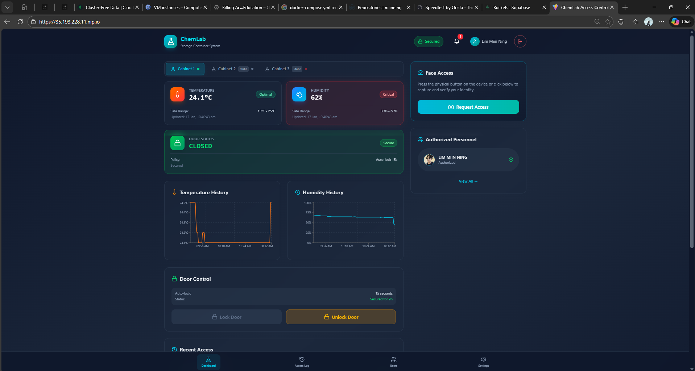
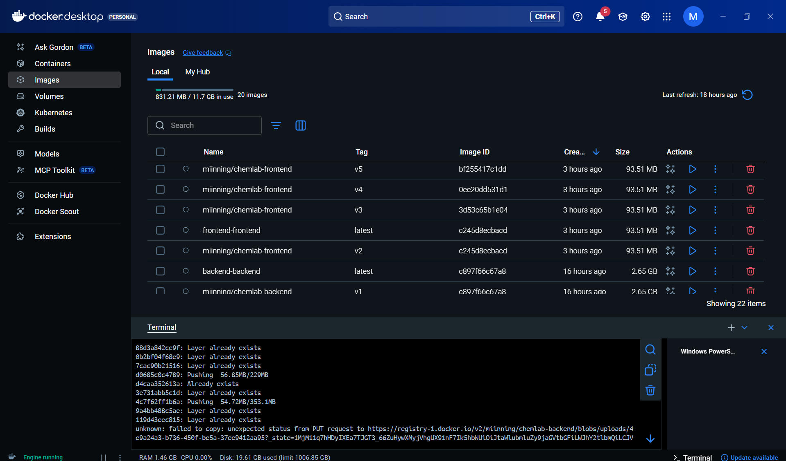

# ChemLab Access Control System 🧪🔐

A comprehensive IoT-based chemical storage access control system featuring **AI face recognition**, **dual-voice feedback**, **environmental monitoring**, **real-time dashboard**, and **intrusion detection**. Frontend and backend are **Docker containerized** and deployed on **GCP Compute Engine** VMs with a dedicated **MQTT broker** for IoT communication.

---

## ✨ Key Features

| Feature | Description |
|---------|-------------|
| 🔐 **AI Face Recognition** | Multi-image biometric authentication using averaged face encodings for robust accuracy |
| 🎤 **Dual Voice System** | Female voice (gTTS) for friendly messages, Male voice (Festival) for security alerts |
| 🌡️ **Environmental Monitoring** | Real-time temperature & humidity tracking with configurable thresholds |
| 🚨 **Intrusion Detection** | IR sensor-based door monitoring with automatic siren and voice alerts |
| 📱 **Mobile-Responsive Dashboard** | Modern React dashboard with bottom navigation and live data |
| 🔒 **Smart Door Lock** | Servo control with 15-second auto-lock and visual countdown timer |
| ⏱️ **Live Countdown** | Real-time countdown displayed on dashboard showing time until auto-lock |
| 📊 **Access Logging** | Complete access history with timestamps stored in Supabase |
| 🔔 **Notification Center** | Slide-out panel with click-outside dismissal for system events |
| 📈 **Historical Charts** | 50-point history stored in **MongoDB Atlas** vs real-time updates via WebSocket |
| 🛡️ **HTTPS Security** | End-to-end encryption using **Let's Encrypt** and Nginx SSL termination |

---

## 🆕 Latest Updates ([2026-01-17])

### 🔐 HTTPS Security Implementation



- **SSL/TLS Encryption**: Enabled HTTPS using **Let's Encrypt** and `nip.io` magic domain (e.g., `https://35.193.228.11.nip.io`).
- **Nginx Termination**: Nginx handles SSL termination on port 443, proxying secure requests to the backend.
- **Auto-Renewal**: Integrated `certbot` sidecar container for automatic certificate renewal.
- **Firewall Config**: Configured GCP Firewall to allow HTTPS (443) traffic.

### 💾 MongoDB Integration (Historical Data)

- **MongoDB Atlas**: Migrated telemetry storage to MongoDB Atlas (Cloud) for persistence.
- **Hybrid Data Visualization**: Frontend charts now load 50 historical points from MongoDB on load, then append real-time WebSocket updates seamlessly.
- **Timezone Handling**: Fixed timezone issues to correctly display server timestamps (Singapore Time) versus browser local time.

## 🆕 Previous Updates

### 🐳 Docker & GCP Cloud Deployment

- **Docker Containerization**: Frontend and Backend fully containerized with optimized multi-stage builds
- **GCP Compute Engine**: Deployed on Google Cloud Platform VMs with dedicated Nginx and MQTT Broker
- **Nginx Reverse Proxy**: Production-ready frontend serving with secure API proxying

### 🗄️ Multi-Cabinet Demo

- **Cabinet Selector Tabs**: Switch between Cabinet 1 (live IoT), Cabinet 2 (offline demo), Cabinet 3 (intrusion alert)
- **Static Demo Data**: Fake temperature, humidity, access logs, and personnel for demo cabinets
- **Intrusion Simulation**: Cabinet 3 shows red alert status, unlocked door, unknown person access, and temp spike
- **Settings Integration**: Environment thresholds configurable per-cabinet with read-only demo mode

### Voice System

- **Dual Voice Profiles**: Context-aware voice selection
  - **Female Voice** (gTTS + mpg123): Friendly, welcoming tone
  - **Male Voice** (Festival/espeak-ng): Authoritative, warning tone
- **Optimized Playback**: Single announcement per action (no overlapping voices)

### Dashboard Improvements

- **Bottom Navigation Bar**: Mobile-friendly tab navigation fixed at screen bottom
- **Real-time Countdown**: 15-second auto-lock countdown with pulsing animation
- **SweetAlert Integration**: Loading indicators during face registration
- **Flask Icon Branding**: ChemLab-themed flask icon throughout the UI
- **Responsive Header**: Compact mobile view with adaptive spacing

### Security Enhancements

- **Unlock Source Tracking**: Differentiates between `authorized` (face), `remote` (dashboard), and `forced` access
- **Immediate Lock on Close**: Door locks instantly when IR sensor detects door closure
- **Smart Intrusion Detection**: Alerts only when door opened without authorization

---

## 🏗️ System Architecture

```
┌─────────────────────────────────────────────────────────────┐
│                    Web Dashboard (React)                     │
│                  http://localhost:5173                       │
│                                                              │
│  ┌─────────────┐  ┌─────────────┐  ┌─────────────────────┐  │
│  │  Dashboard  │  │ Access Log  │  │ Users │ Settings    │  │
│  │             │  │             │  │                     │  │
│  │ • Door Card │  │ • History   │  │ • Add User          │  │
│  │ • Countdown │  │ • Timeline  │  │ • Face Registration │  │
│  │ • Temp/Hum  │  │             │  │ • Thresholds        │  │
│  │ • Charts    │  │             │  │                     │  │
│  └─────────────┘  └─────────────┘  └─────────────────────┘  │
│                                                              │
│  [Bottom Navigation: Dashboard | Access Log | Users | Settings]
└──────────────────────────┬──────────────────────────────────┘
                           │ WebSocket + REST API
┌──────────────────────────▼──────────────────────────────────┐
│                  Backend Server (FastAPI)                    │
│                (Internal Docker Network)                     │
│                                                              │
│  • /api/history          - Fetch MongoDB historical data    │
│  • /api/register-face    - Multi-image face registration    │
│  • /api/trigger          - Remote capture/lock/unlock       │
│  • /ws                   - Real-time WebSocket updates      │
│  • MQTT Handler          - Bi-directional IoT communication │
│  • Anomaly Detection     - Temperature/humidity monitoring  │
└──────────────────────────┬──────────────────────────────────┘
                           │ MQTT Protocol (chemlab/*)
┌──────────────────────────▼──────────────────────────────────┐
│               Raspberry Pi 2 Model B                         │
│                                                              │
│  ┌─────────────────┐  ┌─────────────────────────────────┐   │
│  │ Input Sensors   │  │ Output Actuators                │   │
│  │                 │  │                                 │   │
│  │ • Pi Camera     │  │ • Servo Motor (Door Lock)       │   │
│  │ • DHT11 Sensor  │  │ • Red LED (Visual Alert)        │   │
│  │ • Push Button   │  │ • Buzzer (Audio Alert)          │   │
│  │ • IR Sensor     │  │ • Speaker (Voice Feedback)      │   │
│  └─────────────────┘  └─────────────────────────────────┘   │
│                                                              │
│  ┌─────────────────────────────────────────────────────┐    │
│  │ Voice Modules                                        │    │
│  │ • voice/femaleTalk.py - gTTS + mpg123               │    │
│  │ • voice/maleTalk.py   - Festival/espeak-ng          │    │
│  └─────────────────────────────────────────────────────┘    │
│  │                                 │                        │
│  │  ┌──────────────┐               ▼                        │
│  │  │ MongoDB Atlas│◄───────────[Telemetry Data]            │
│  │  │ (Cloud DB)   │                                        │
│  │  └──────────────┘                                        │
└─────────────────────────────────────────────────────────────┘
```

---

## 🛠️ Technology Stack

| Layer | Technologies |
|-------|--------------|
| **Frontend** | React 19, TypeScript, TailwindCSS, Recharts, SweetAlert2, Lucide Icons |
| **Backend** | Python 3.11, FastAPI, face_recognition, paho-mqtt, Uvicorn |
| **Database** | Supabase (Users/Logs) + MongoDB Atlas (Telemetry History) |
| **IoT** | Raspberry Pi 2 Model B, RPi.GPIO, Adafruit_DHT, PiCamera |
| **Voice** | gTTS, Festival, espeak-ng, mpg123 |
| **Communication** | MQTT (paho-mqtt), WebSocket, REST API |

---

## 📁 Project Structure

```
chemical_detector/
├── backend/
│   ├── server.py              # FastAPI server, face recognition, MQTT
│   ├── requirements.txt       # Python dependencies
│   └── .env                   # Supabase + MQTT credentials
├── frontend/
│   ├── src/
│   │   └── App.tsx            # Main React application (1700+ lines)
│   ├── types.ts               # TypeScript interfaces
│   ├── constants.tsx          # Theme, initial state, tabs
│   └── package.json           # Node dependencies
├── raspberry_iot/
│   ├── iot_code.py            # Main Raspberry Pi controller
│   ├── requirements_iot.txt   # Pi-specific dependencies
│   ├── .env.iot               # MQTT + Supabase credentials
│   └── voice/
│       ├── maleTalk.py        # Male voice
│       ├── femaleTalk.py      # Female voice
│       └── testTalk.py        # Voice testing utility
└── README.md                  # This documentation
```

---

## 🚀 Installation Guide (Services)

### Prerequisites

- Python 3.11+ (Miniconda recommended for Windows)
- Node.js 18+
- Raspberry Pi 2/3/4 with Pi Camera
- Supabase account (PostgreSQL + Storage)
- MQTT Broker (e.g., Mosquitto, HiveMQ Cloud)

### 🐍 Hybrid Dependency Strategy: Local vs. Cloud

We use a **hybrid approach** to handle the complex C++ dependencies of `face_recognition` (specifically `dlib`):

| Environment | OS | Dependency Manager | Reason |
|-------------|----|--------------------|--------|
| **Local Development** | Windows 10/11 | **Miniconda** | **Mandatory.** Compiling `dlib` from source on Windows is notoriously difficult. Conda provides pre-compiled binaries (`conda install dlib`), bypassing errors. |
| **Cloud Deployment** | Linux (Docker) | **Pip + System** | **Standard.** The Docker container uses a lightweight Linux base. Compiling `dlib` from source on Linux is reliable. We use `pip` to keep it standard. |

**Install Miniconda (Windows/Mac/Linux):**
```bash
# Windows: https://docs.conda.io/en/latest/miniconda.html
# Linux:
wget https://repo.anaconda.com/miniconda/Miniconda3-latest-Linux-x86_64.sh && bash Miniconda3-latest-Linux-x86_64.sh
```

### 1. Backend Server Setup (Local)

```bash
# Clone
git clone <repository-url>
cd chemical_detector

# Create environment (REQUIRED for dlib)
conda create -n chemlab python=3.11 -y
conda activate chemlab

# Install dependencies
conda install -c conda-forge dlib -y
pip install face_recognition
cd backend
pip install -r requirements.txt

# Configure .env
cp .env.example .env
# Edit .env with Supabase & MQTT credentials

# Run Server
uvicorn server:app --host 0.0.0.0 --port 8000 --reload
```

### 2. Frontend Setup (Local)

```bash
cd frontend
npm install
npm run dev
# Dashboard available at http://localhost:5173
```

---

## 🐳 Docker Deployment Guide (Production)

### 🌟 Why Docker?

We utilize **Docker** containers to ensure a robust, enterprise-grade deployment:

- **🔄 Reproducibility**: "It works on my machine" is solved. The exact same environment runs on development, testing, and production.
- **📈 Scalability**: The stateless frontend and backend services can be horizontally scaled across multiple VMs behind a load balancer.
- **🛡️ Fault Tolerance**: Containers are isolated. If the backend crashes, the frontend stays up (and vice versa). Docker Compose can automatically restart failed services.
- **🚀 Rapid Deployment**: Updates are pushed as new image tags (`:latest`), allowing for rolling updates with minimal downtime.

The deployment process consists of two main phases: **Containerization** (building images locally) and **Cloud Deployment** (running them on GCP VMs).

### Docker Files Reference

| File | Purpose |
|------|---------|
| `backend/Dockerfile` | FastAPI + face_recognition (Linux build) |
| `frontend/Dockerfile` | Multi-stage Node.js + Nginx |
| `frontend/nginx.conf` | Reverse proxy configuration |

### Phase 1: Docker Containerization (Local)

Build and push the images to Docker Hub.



```bash
# 1. Backend Image
cd backend
docker build -t yourusername/chemlab-backend:latest .
docker push yourusername/chemlab-backend:latest

# 2. Frontend Image
cd frontend
docker build -t yourusername/chemlab-frontend:latest .
docker push yourusername/chemlab-frontend:latest
```

### Phase 2: Deploy to GCP Compute Engine VMs

Our production environment uses **GCP Compute Engine** VMs in the `us-central1-c` region:

| VM Instance | OS | Machine Type | Resources | Purpose |
|-------------|-----|--------------|-----------|---------|
| **chemlab-frontend** | Ubuntu 22.04 LTS | e2-medium | 2 vCPUs, 4 GB RAM | React Dashboard + Nginx |
| **chemlab-backend** | Ubuntu 22.04 LTS | e2-standard-2 | 2 vCPUs, 8 GB RAM | FastAPI + Face Recognition |
| **chemical-mqtt-broker** | Debian 12 | e2-micro | 2 vCPUs, 1 GB RAM | Mosquitto MQTT Broker |

**Deployment Steps via Google Cloud Console:**

1. **Create VMs** according to the specs above.
2. **SSH into each VM** and install Docker:
   ```bash
   sudo apt update && sudo apt install -y docker.io
   sudo usermod -aG docker $USER && newgrp docker
   ```
3. **Run Backend Container (`chemlab-backend` VM):**
   ```bash
   docker run -d -p 8000:8000 --name backend \
     -e SUPABASE_URL="https://xxx.supabase.co" \
     -e SUPABASE_KEY="your-key" \
     -e MQTT_BROKER="<internal-broker-ip>" \
     yourusername/chemlab-backend:latest
   ```
   *Note: Use the internal IP of the MQTT broker VM.*

4. **Run Frontend Container (`chemlab-frontend` VM):**
   ```bash
   docker run -d -p 80:80 --name frontend yourusername/chemlab-frontend:latest
   ```

5. **Firewall Configuration (GCP VPC):**
   *Create firewall rules to strictly control ingress traffic:*

   | Rule Name | Target Tag | Port | Source IP | Purpose |
   |-----------|------------|------|-----------|---------|
   | `allow-http` | `http-server` | 80 (TCP) | `0.0.0.0/0` | ACME Challenge & Redirection |
   | `allow-https` | `https-server` | 443 (TCP) | `0.0.0.0/0` | Secure Encrypted Web Traffic |
   | `allow-mqtt-internal` | `mqtt-broker` | 1883 (TCP) | `10.128.0.0/9` | IoT Devices (Internal VPC Only) |
   | `deny-backend-ext` | `backend` | 8000 (TCP) | `0.0.0.0/0` | **BLOCKED** (No public access) |

   **GCP CLI Commands:**
   ```bash
   # Public Web Access
   gcloud compute firewall-rules create allow-http-https \
     --allow tcp:80,tcp:443 --target-tags=http-server,https-server
     
   # Internal MQTT Access (VPC Only)
   gcloud compute firewall-rules create allow-internal-mqtt \
     --allow tcp:1883 --source-ranges=10.128.0.0/9 --target-tags=mqtt-broker
   ```

### 🔒 Nginx Reverse Proxy & SSL Termination

The frontend container uses **Nginx** providing critical security:

| Security Feature | Description |
|-----------------|-------------|
| **SSL/TLS** | Auto-renewing **Let's Encrypt** certificates via Certbot sidecar |
| **HTTPS Redirect** | Forces all HTTP traffic to HTTPS (Port 80 → 443) |
| **API Proxying** | Routes `/api/` to backend, hiding server topology |
| **Security Headers** | Enforces `X-Frame-Options`, `X-XSS-Protection` |

**Nginx Configuration Snippet (HTTPS):**
```nginx
server {
    listen 443 ssl;
    server_name 35.x.x.x.nip.io; # Magic Domain

    # SSL Certificates (Managed by Certbot)
    ssl_certificate /etc/letsencrypt/live/.../fullchain.pem;
    ssl_certificate_key /etc/letsencrypt/live/.../privkey.pem;

    # Proxy API Securely
    location /api/ {
        proxy_pass http://backend:8000/api/;
    }
}
```

### 🛡️ Defense-in-Depth Security Layers

Beyond HTTPS, the system implements multiple layers of security:

| Layer | Implementation | Benefit |
|-------|----------------|---------|
| **Biometric** | **Multi-Shot Face Recognition** | Uses averaged 128-d embeddings from 5+ images to prevent spoofing. |
| **Network** | **Zero-Trust Isolation** | Docker containers (Backend/Mongo) connect on a private bridge network `chemlab-network`. They do not map ports to the host interface, making them **invisible** to the outside world. |
| **Transport** | **End-to-End Encryption** | HTTPS for web traffic; Local VPC routing for MQTT. |
| **Physical** | **Fail-Secure Locking** | Door servo defaults to "Locked" state; auto-locks after 15s. |
| **Audit** | **Immutable Access Logs** | Every access attempt (Grant/Deny) is logged to Supabase with timestamp & snapshot. |

### Docker Architecture

```mermaid
┌─────────────────────────────────────────────────────────────┐
│                    GCP Cloud Infrastructure                  │
├─────────────────────────────────────────────────────────────┤
│  ┌─────────────────────┐      ┌─────────────────────┐       │
│  │  Frontend VM        │      │  Backend VM          │       │
│  │  (Nginx + React)    │      │  (FastAPI + dlib)    │       │
│  │  Port 443 (HTTPS)   │──────│  Port 8000 (Internal)│       │
│  │                     │ 10.x │                      │       │
│  │  /api/* → proxy ────┼──────┼──→ Backend API       │       │
│  │  /ws   → proxy ─────┼──────┼──→ WebSocket         │       │
│  └─────────────────────┘      └─────────────────────┘       │
└─────────────────────────────────────────────────────────────┘
            ▲ (Encrypted)                ▲
     Browser/Mobile              Raspberry Pi (MQTT)
```

---

## 🔌 Hardware Setup (IoT)

### Raspberry Pi Configuration

```bash
# Install dependencies
sudo apt-get install -y python3-pip python3-dev libatlas-base-dev mpg123 festival espeak-ng

# Install Python packages
cd raspberry_iot
pip3 install -r requirements_iot.txt

# Configure
cp .env.iot.example .env.iot
# Edit .env.iot with MQTT/Supabase credentials

# Run
python3 iot_code.py
```

### GPIO Pinout (Pi 2 Model B)

| Component | GPIO | Pin | Notes |
|-----------|------|-----|-------|
| **DHT11** | 27 | 13 | 10kΩ pull-up |
| **Button** | 17 | 11 | Internal pull-up |
| **Red LED** | 22 | 15 | 220Ω resistor |
| **IR Sensor** | 24 | 18 | 3.3V |
| **Buzzer** | 25 | 22 | PWM |
| **Servo** | 12 | 32 | PWM0 |

---

## 📡 MQTT Communication

**Topic Structure:**

| Topic | Direction | Purpose |
|-------|-----------|---------|
| `chemlab/telemetry` | Pi → Backend | Temp/Humidity Data |
| `chemlab/access` | Pi → Backend | Face Capture URL |
| `chemlab/access_response` | Backend → Pi | Auth Result |
| `chemlab/status` | Pi → Backend | Door State |
| `chemlab/intrusion` | Pi → Backend | Security Alerts |

---

## 🔄 User Workflow

### 1. Registration
Admin uploads 3-5 photos. System computes averaged template.

### 2. Access Request
User presses button. Camera captures photo. Backend authenticates.

### 3. Response
- **Authorized:** Female voice ("Access Granted"), Door opens (15s).
- **Unauthorized:** Male voice ("Access Denied"), Siren, Red LED.

### 4. Auto-Lock
Door locks automatically after 15s or immediately when closed (IR sensor).

---

## 🎤 Voice System Details

**Female Voice (gTTS)**: Friendly. Used for greetings and regular status (e.g., "Door closed").
**Male Voice (Festival)**: Authoritative. Used for alerts and warnings (e.g., "Intrusion Detected").

---

## ⚙️ Environment Variables

**Backend (`.env`)**
```env
SUPABASE_URL=...
SUPABASE_KEY=...
MQTT_BROKER=...
MQTT_PORT=1883
```

**Frontend (`.env`)**
```env
VITE_API_URL=http://<backend-ip>:8000
VITE_WS_URL=ws://<backend-ip>:8000/ws
```

**For HTTPS Production:**
Leave variables **EMPTY**. The frontend auto-detects `https://` and upgrades to `wss://` automatically.
```env
# Leave commented out for auto-detection
# VITE_API_URL=
# VITE_WS_URL=
```

---

## 🔧 Troubleshooting

| Issue | Solution |
|-------|----------|
| `face_recognition` error | Use **Miniconda** (local) or **Docker** (cloud). |
| Camera not detected | `sudo raspi-config` → Interface → Enable Camera. |
| **Container DNS Issue** | If container can't resolve domains, add `dns: [8.8.8.8]` to `docker-compose.yml`. |

---

## 🤝 Contributing & License

1. Fork & Clone
2. Create Feature Branch
3. Submit PR

**License:** MIT
*Built with ❤️ for secure chemical storage management*
