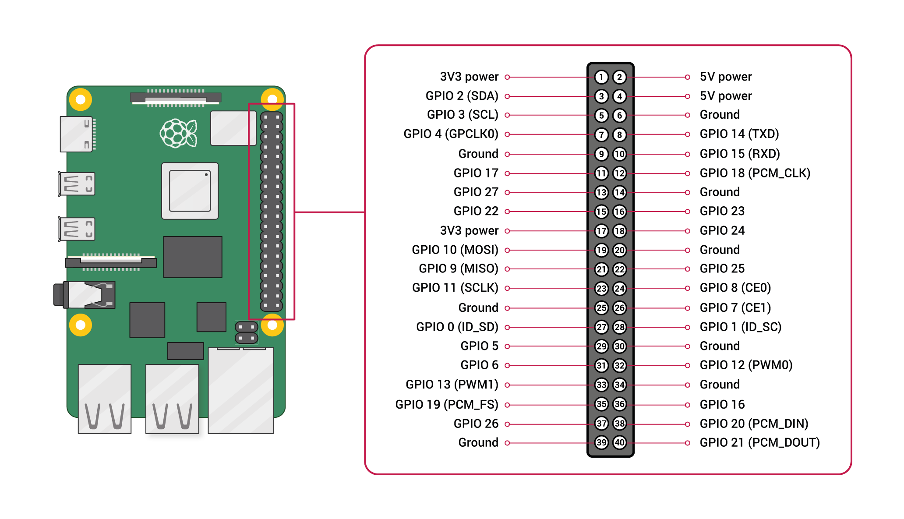

# Chemical Lab Storage System - IoT Technical Info

This document provides the hardware wiring diagram and MQTT topic specifications for the Raspberry Pi 2 Model B.



## 📌 GPIO Pin Diagram (BCM Mode)

| Component | GPIO Pin | Physical Pin | Type | Notes |
|-----------|----------|--------------|------|-------|
| **DHT11 Data** | GPIO 27 | Pin 13 | Input | Humidity/Temp sensor (needs 10kΩ pull-up) |
| **Button** | GPIO 17 | Pin 11 | Input | Captures face (Internal pull-up enabled) |
| **Red LED** | GPIO 22 | Pin 15 | Output | Visual alert (Pattern: 0.2s on/0.3s off) |
| **IR Sensor** | GPIO 24 | Pin 18 | Input | Intrusion detection (LOW = blocked) |
| **Buzzer** | GPIO 25 | Pin 22 | Output | Audio alert (Pattern: 0.2s on/0.3s off) |
| **Servo Motor** | GPIO 12 | Pin 32 | PWM | Door lock (0° Lock, 90° Unlock) |

### Physical Layout (Raspberry Pi 2 Header)
```
          (1)  3.3V  [ ] [ ]  5V (2)
          (3) GPIO2  [ ] [ ]  5V (4)
          (5) GPIO3  [ ] [ ]  GND (6)
          (7) GPIO4  [ ] [ ]  GPIO14 (8)
          (9)  GND   [ ] [ ]  GPIO15 (10)
 Button ← (11) GPIO17 [ ] [ ]  GPIO18 (12)
  DHT11 ← (13) GPIO27 [ ] [ ]  GND (14)
    LED ← (15) GPIO22 [ ] [ ]  GPIO23 (16)
          (17) 3.3V   [ ] [ ]  GPIO24 (18) → IR Sensor
          (19) GPIO10 [ ] [ ]  GND (20)
          (21) GPIO9  [ ] [ ]  GPIO25 (22) → Buzzer
          (23) GPIO11 [ ] [ ]  GPIO8 (24)
          (25)  GND   [ ] [ ]  GPIO7 (26)
          (27)  ID_SD [ ] [ ]  ID_SC (28)
          (29) GPIO5  [ ] [ ]  GND (30)
          (31) GPIO6  [ ] [ ]  GPIO12 (32)
  Servo ← (33) GPIO13 [ ] [ ]  GND (34)
          (35) GPIO19 [ ] [ ]  GPIO16 (36)
          (37) GPIO26 [ ] [ ]  GPIO20 (38)
          (39)  GND   [ ] [ ]  GPIO21 (40)
```

---

## 📡 MQTT Topic List

| Topic | Direction | Payload Description |
|-------|-----------|---------------------|
| `chemlab/telemetry` | Pi → Server | `{ "temperature_celsius": 24.5, "humidity_percent": 50 }` |
| `chemlab/access` | Pi → Server | `{ "image_url": "..." }` - Triggered by button press |
| `chemlab/access_response` | Server → Pi | `{ "authorized": true/false, "name": "Name" }` |
| `chemlab/intrusion` | Pi → Server | `{ "message": "Manual intrusion detected" }` (IR trigger) |
| `chemlab/alert` | Pi → Server | `{ "alert_type": "door_open", "message": "..." }` |
| `chemlab/status` | Pi → Server | `{ "door_state": "locked/unlocked", "last_access_by": "..." }` |
| `chemlab/command` | Server → Pi | `{ "command": "capture" }` or `"lock"`/`"unlock"`/`"alert"` |

---

## 🚨 Alert Pattern Logic

Whenever an alert is triggered (unauthorized face, intrusion, or environment anomaly), the Pi executes the following for **~2.5 seconds**:

- **LED (GPIO 22)**: 0.2s ON, 0.3s OFF
- **Buzzer (GPIO 25)**: 0.2s ON, 0.3s OFF
- **Interval**: 5 cycles total.

---

## 🔐 Door Control Logic

1. **Authorized Access**: Servo moves to **90°**.
2. **Auto-Lock**: After 10 seconds, servo returns to **0°**.
3. **Reminder**: If the IR sensor (GPIO 24) does not detect the door "closing" (object returned) within **2 minutes**, the alert pattern triggers every 2 minutes until closed.
